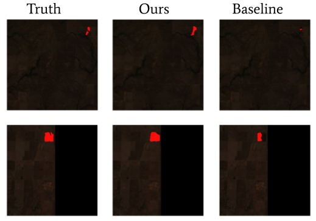
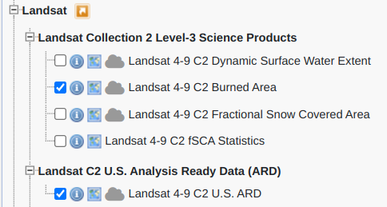

# ai4con-wildfire
## Project Description

Forest fires cause severe environmental, economic, and social damage, including habitat loss, soil degradation, greenhouse gas emissions, and threats to human life and infrastructure. Effective wildfire control and recovery require precise detection and mapping of burned areas. Rapid and detailed mapping enhances disaster response, resource allocation, ecosystem restoration, and policy-making. It informs land-use decisions, fire management strategies, and climate adaptation efforts. This project leverages advanced AI algorithms to offer scalable, reliable solutions for detecting and mapping burned areas, addressing a globally critical challenge.



# Running the project
## Data Gathering

The first thing you need to do is go to https://earthexplorer.usgs.gov/ and download
images from the following datasets:
- Landsat 4-9 C2 Burned Area
- Landsat 4-9 C2 U.S. ARD



This can be done through their bulk downloader. I won't go through each step in downloading the files.
But the file structure needs to have all the files all in one folder, like below.

```
landsat_raw/
  - LC08_AK_000009_20241103_20241117_02_SR_B1.TIF
  - LC08_AK_000010_20241027_20241108_02_SR_B4.TIF
  - LC08_HI_001001_20241102_20241117_02_SR_B3.TIF
  - LC08_CU_001007_20241030_20241108_02_BC.TIF
  - LC08_CU_001007_20241030_20241108_02_BP.TIF
```

## Data Preprocessing
 The data can now be processed from 5000x5000 pixel images into smaller blocks.
In `landsat_data_parser.py`, change the following variables:
- `dir` <- this should be where the raw landsat TIF files are (landsat_raw in this README).
- `save_dir` <- this is where the smaller blocks should go.

After running the python script to parse the files, you should get a folder with .npz
files like below.
```
data_blocks/
  - LC09_CU_011002_20241108_20241113_02_mask_block_7.pt.npz
  - LC09_CU_011002_20241108_20241113_02_mask_block_8.pt.npz
  - LC09_CU_011002_20241108_20241113_02_mask_block_10.pt.npz
```

Next is the splitting into train/val/test sets and the mean & std compuation.
Open up the `data_preprocessor.ipynb` and change the following variables:
- `data_dir` <- this is where the smaller blocks are (data_blocks in this README)
- `save_dir` <- this is where the final processed blocks should go.

Run the notebook and you should end up with the following:
```
data_processed/
  mean_std.json
  train/
    - LC09_CU_011002_20241108_20241113_02_mask_block_8.pt.npz
  val/
    - LC09_CU_011002_20241108_20241113_02_mask_block_9.pt.npz
  test/
    - LC09_CU_011002_20241108_20241113_02_mask_block_10.pt.npz
```

### Note:
They are stored as floats from 0 to 1 representing the radiance observed.
A block is represented as:
- data["image"] <- (H, W, C)
- data["mask"] <- (H, W)

## Config File
Before starting the training, you must edit the config file.
There is an example config.yml that you can edit.
- It also includes the augmentation transformations in it.
```yml
experiment_config:
  loader_params:
    data_dir: "./data_infrared_split"
    batch_size: 32
    seed: null
  train:
    max_epochs: 75
    save_on_metric: "best_dice"
  criterion:
    # name: "BCEWithLogitsLoss"
    name: "FocalLoss"
    alpha: 1
    gamma: 2
  optimizer:
    name: "AdamW"
    lr: 0.0001
transforms:
  - name: "HorizontalFlip"
    params:
      p: 0.5
  - name: "VerticalFlip"
    params:
      p: 0.5
  - name: "RandomRotate90"
    params:
      p: 0.5
  - name: "Transpose"
    params:
      p: 0.5
  # - name: "RandomBrightnessContrast"
  #   params:
  #     p: 0.2

```

## Train
Start visdom server in a seperate terminal
```bash
python -m visdom.server
```

In a different terminal:
```bash
python main.py --config /path/to/config.yml
python main.py --config /path/to/config.yml --name Something
```
The name is optional.


## Evaluation
The results will be automatically computed after training and stored in the experiment dir:
- `experiments/TIME_NAME/results_val.json`
- `experiments/TIME_NAME/results_test.json`
- `experiments/TIME_NAME/metrics.json`
- `experiments/TIME_NAME/model_best_METRIC.pt`
- `experiments/TIME_NAME/model_final.pt`

## Results Visualization
The results can be visualized through the `results.ipynb`.
However, this file was rushed and will not work since it was bodged together to get results.